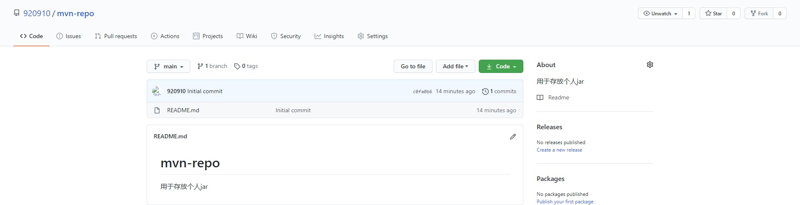
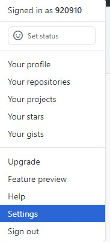
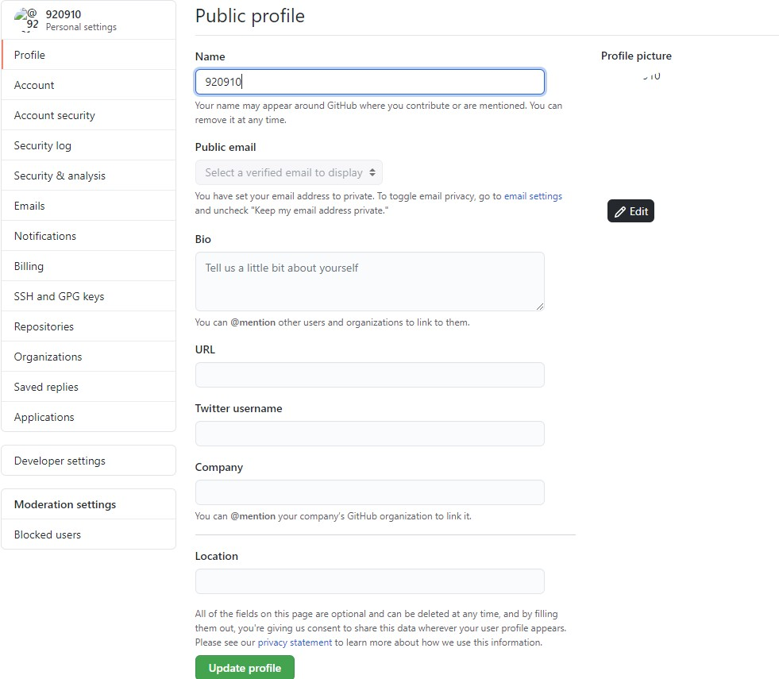
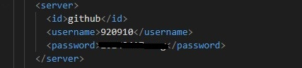
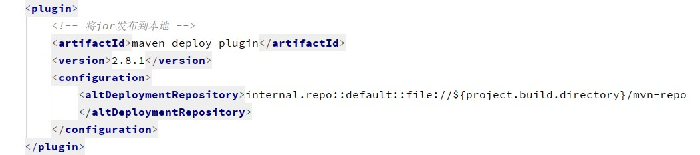
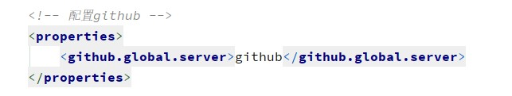
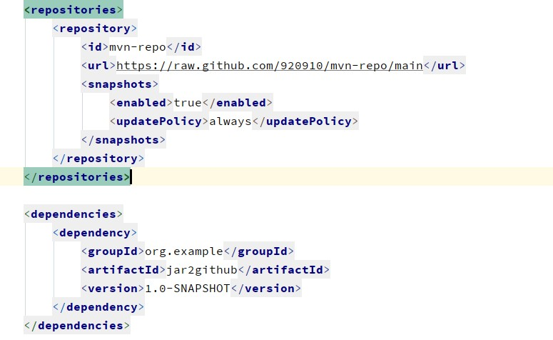

# 在GitHub上创建仓库mvn-repo



# GitHub设置




# 配置maven的settings.xml



``` xml
    <server>
      <id>github</id>
      <username>920910</username>
      <password>xxx</password>
    </server>
```

# 在maven项目的pom.xml中添加配置发布到本地



``` xml
<plugin>
    <!-- 将jar发布到本地 -->
    <artifactId>maven-deploy-plugin</artifactId>
    <version>2.8.1</version>
    <configuration>
        <altDeploymentRepository>internal.repo::default::file://${project.build.directory}/mvn-repo
        </altDeploymentRepository>
    </configuration>
</plugin>
```

# 在maven项目的pom.xml中添加配置发布到GitHub


``` xml
<plugin>
    <!-- 将jar发布到github -->
    <groupId>com.github.github</groupId>
    <artifactId>site-maven-plugin</artifactId>
    <version>0.12</version>
    <configuration>
        <message>Maven artifacts for ${project.version}</message>
        <noJekyll>true</noJekyll>
        <!--本地jar地址-->
        <outputDirectory>${project.build.directory}/mvn-repo</outputDirectory>
        <!--分支的名称-->
        <branch>refs/heads/main</branch>
        <merge>true</merge>
        <includes>
            <include>**/*</include>
        </includes>
        <!--对应github上创建的仓库名称 name-->
        <repositoryName>mvn-repo</repositoryName>
        <!--github 仓库所有者即登录用户名-->
        <repositoryOwner>920910</repositoryOwner>
    </configuration>
    <executions>
        <execution>
            <goals>
                <goal>site</goal>
            </goals>
            <phase>deploy</phase>
        </execution>
    </executions>
</plugin>
```

# 在maven项目的pom.xml中添加GitHub配置



``` xml
<!-- 配置github -->
<properties>
    <github.global.server>github</github.global.server>
</properties>
```

# 命令行执行

``` sh
mvn clean deploy
```

# 新建项目在pom中添加配置


